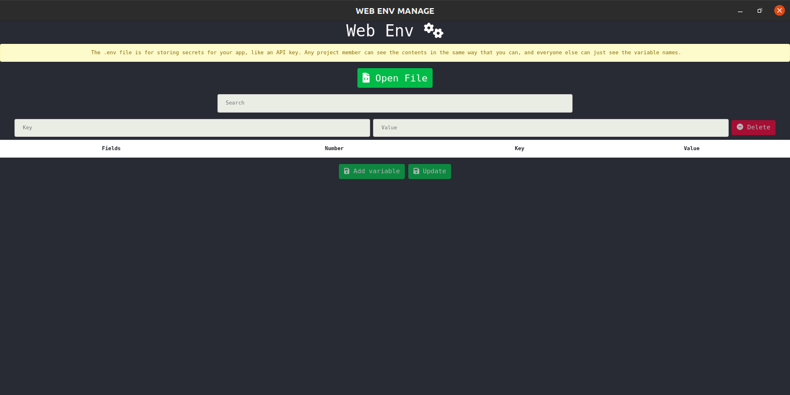
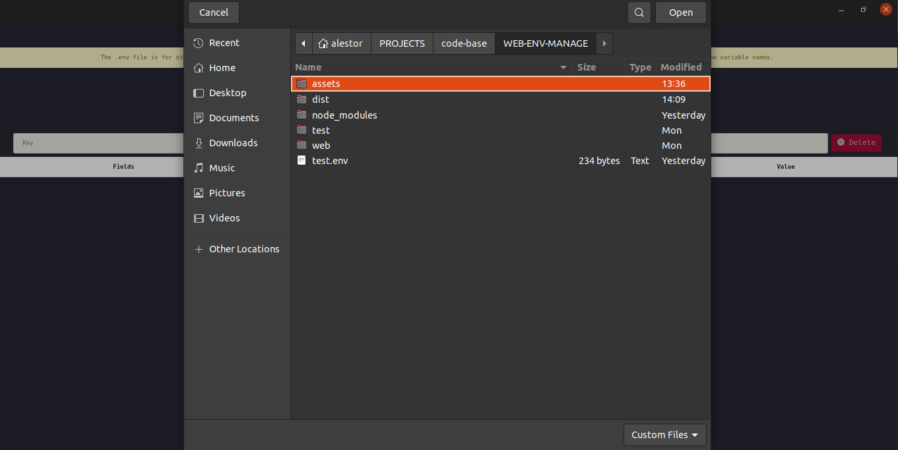
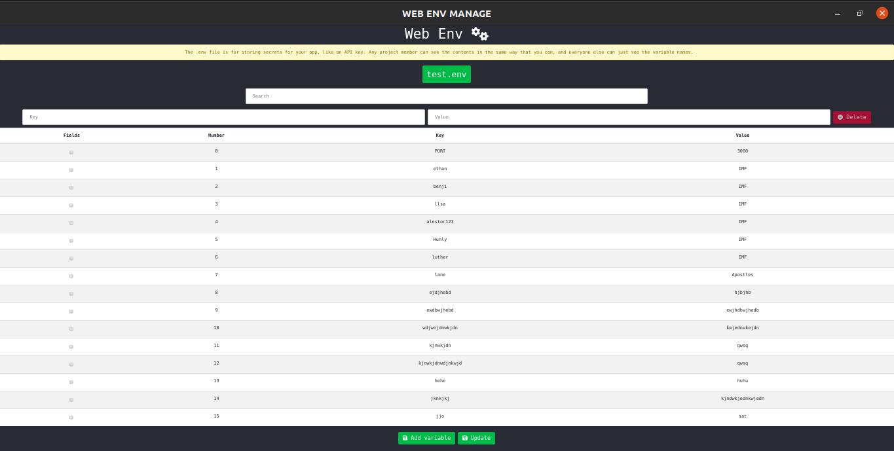
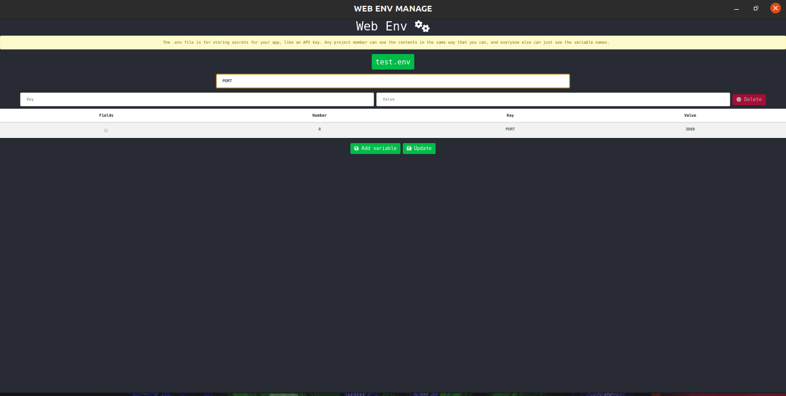
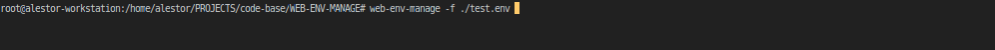

<p align=center>

</p>

<h1 align=center>WEB-ENV-MANAGE</h1>

> This is a simple code managing env variables

<p align=center>

<a href="https://github.com/alestor123/WEB-ENV-MANAGE/issues">
</a>

</p>

## 🚀 Usage


## Quick use
```
$ web-env-manage -f <input env file> 

```
## CLI Installation
```
$ dpkg -i ./dist/web-env-manage_1.0.0_amd64.deb
```
```
$ web-env-manage
```
# Screenshots    








## 💖 [Donate](https://alestor123.is-a.dev/donate)


## Author

👤 **Alestor Aldous**

- Twitter: [@alestor123](https://twitter.com/alestor123)
- Github: [@alestor123](https://github.com/alestor123)


## 📝 License
> MIT

Copyright © 2022 [Alestor Aldous](https://github.com/alestor123).<br />
